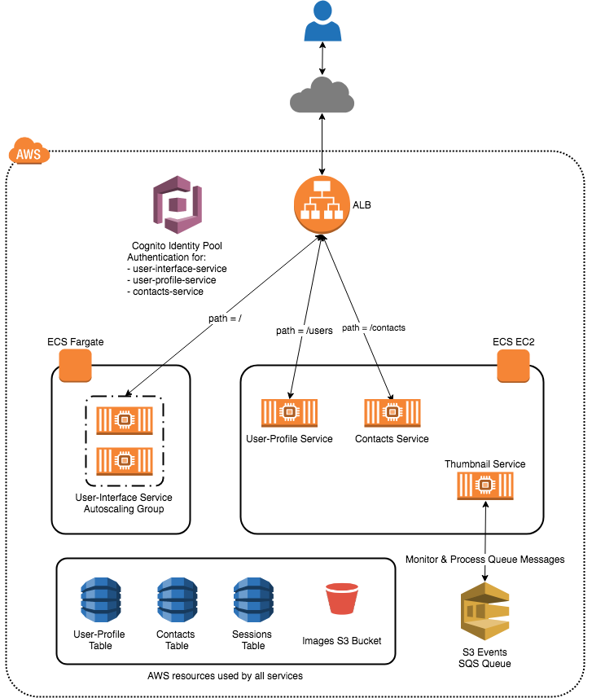
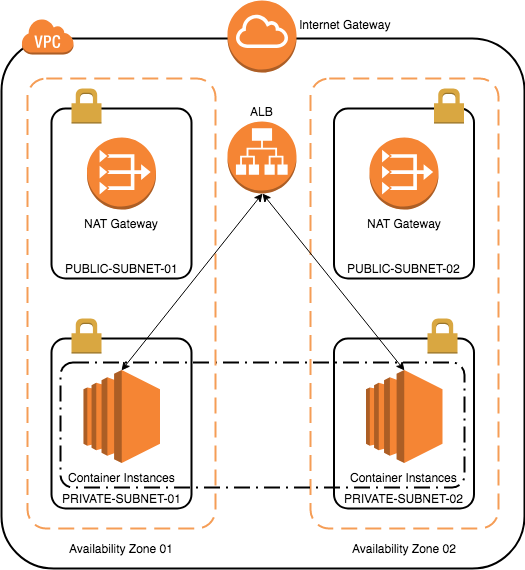

# Deploy and manage Microservices on ECS and Fargate

In this workshop we will deploy a microservices based Contacts Management application on Amazon Elastic Container Service (ECS). We will also a build a CodePipeline for one of the microservices to establish continuous delivery.

___

## Application Overview


___

## Prerequisites

The following prerequistied are required for the workshop:

- AWS Console Access
- AWS CLI installed and configured on your Workstation/PC.
- A VPC with:
    - 2 Public Subnets in different AZs
    - 2 Private Subnets in different Availability Zones
    - A NAT-Gateway, one in each Public Subnet
    - A Route Table with route to internet via NAT Gateway for the instances in Private Subnets.
- An EC2 SSH Key-Pair
- Docker installed on your Workstation/PC to build docker images.
    - [Docker for Mac](https://store.docker.com/editions/community/docker-ce-desktop-mac)
    - [Docker for Windows](https://store.docker.com/editions/community/docker-ce-desktop-windows)
- Download the sample code from **GITHUB-LINK**
- Supporting AWS Resources - S3 Bucket, SQS, DynamoDB & Cognito User Pool.


**Network Layout**




A CloudFormation template has been provided to create the supporting AWS resources. Use the below command to create the CloudFormation stack.

**Note** The CloudFormation stack will try to create a DynamoDB Table named **sessions**. If you already have a DynamoDB table named **sessions** either delete the table or use another AWS Region.

```bash
aws cloudformation create-stack \
--stack-name contact-mgmt-stack \
--template-body file://cfn-templates/prereq-cfn-template.yaml \
--capabilities CAPABILITY_IAM CAPABILITY_NAMED_IAM \
--parameters \
ParameterKey="VpcId",ParameterValue="<VPC-ID>" \
ParameterKey="PublicSubnet01",ParameterValue="<PUBLIC-SUBNET-01-ID>" \
ParameterKey="PublicSubnet02",ParameterValue="<PUBLIC-SUBNET-02-ID>" \
ParameterKey="PrivateSubnet01",ParameterValue="<PRIVATE-SUBNET-01-ID>" \
ParameterKey="PrivateSubnet02",ParameterValue="<PRIVATE-SUBNET-02-ID>" \
ParameterKey="SshKeyName",ParameterValue="<SSH-KEY-NAME>" \
ParameterKey="CognitoUserPoolName",ParameterValue="contacts-mgmt-app-cognito-user-pool" \
ParameterKey="ECSClusterName",ParameterValue="contacts-mgmt-app-cluster" \
ParameterKey="ECSClusterSize",ParameterValue="2"
```

Login to the AWS Console and navigate to the CloudFormation console. Check the status of the CloudFormation stack that we just created. Once the stack creation is complete, note the Stack Outputs.

### Configuring the Cognito User Pool

The CloudFormtion template created a Cognito User-Pool and a Cognito App client. We will now configure the address of your sign-up and sign-in webpages using the hosted Amazon Cognito domain with your own domain prefix.

1. Create a Cognito User-Pool domain.

```bash
aws cognito-idp create-user-pool-domain \
--domain <SOME-UNIQUE-ID> \
--user-pool-id <CognitoUserPoolId>
```

2. Change the Cognito Email verification to type **Link**.

```bash
aws cognito-idp update-user-pool --user-pool-id <CognitoUserPoolId> \
--auto-verified-attributes "email" \
--verification-message-template \
"{
    \"EmailMessageByLink\": \"Please click the link below to verify your email address. {##Verify Email##}\",
    \"EmailSubjectByLink\": \"Your verification link\",
    \"DefaultEmailOption\": \"CONFIRM_WITH_LINK\"
}"
```
___

## Task 1 - Build and deploy Thumbnail-Service

In this section we will build and deploy the **thumbnail-service** as an ECS service. We will deploy the service on Container instances. The thumbnail-service is a daemon process and no external interactions happens with this service. This service monitors the SQS queue and creates thumbnails, no TCP ports are required to be exposed.

The ECS Task-Definition and Service-Definition are located in the thumbnail-service folder.

[Lab guide for Task-1](lab-guides/thumbnail-service.md)

___

## Task 2 - Setup Application Load Balancer path-based routing

You can create a Application Load Balancer(ALB) listener with rules to forward requests based on the URL path. This is known as **path-based routing**. If you are running microservices, you can route traffic to multiple back-end services using path-based routing.

The ALB, Listner and the necessary Target groups have been created by the CloudFormation Stack we created in the **Prerequistes** section of this lab. We will add rules to the ALB Listener to enable path-based routing to the respective backend microservices.

[Lab guide for Task-2](lab-guides/alb-routing.md)

___

## Task 3 - Build and deploy Contacts-Service

In this section we will build and deploy the **contacts-service** as an ECS service. We will deploy the service on Container instances.

The ECS Task-Definition and Service-Definition are located in the contacts-service folder.

[Lab guide for Task-3](lab-guides/contacts-service.md)

___

## Task 4 - Build and deploy User-Profile-Service

In this section we will build and deploy the **user-profile-service** as an ECS service. We will deploy the service on Container instances.

The ECS Task-Definition and Service-Definition are located in the user-profile-service folder.

[Lab guide for Task-4](lab-guides/user-profile-service.md)

___

## Task 5 - Build and deploy User-Interface-Service

In this section we will build and deploy the **user-interface-service** as an ECS service. We will deploy the service as an **ECS Fargate** service with **auto-scaling** behind an **Application Load Balancer (ALB)**.

The ECS Task-Definition and Service-Definition are located in the user-interface-service folder.

[Lab guide for Task-5](lab-guides/user-interface-service.md)

___

## Task 6 - Create a CodePipeline for the User-Interface service

In this task we will setup a CodePipeline for the User-Interface service. The CodePipeline will be triggered when we commit a change to the CodeCommit repository. The CodePipeline will build the Docker image, push the new image to ECR and finally update the user-interface ECS service.

Before we begin ensure that you have installed Git and setup the Git credentials to access the CodeCommit repositories. For instructions on setting up the Git credentials refer the [documentation](https://docs.aws.amazon.com/codecommit/latest/userguide/setting-up-ssh-unixes.html)

[Lab guide for Task-6](lab-guides/codepipeline.md)

___

## Clean Up

Congratulations on successfully completing the workshop. Time to cean up or environment.

[Lab guide for Clean-Up](lab-guides/cleanup.md)
